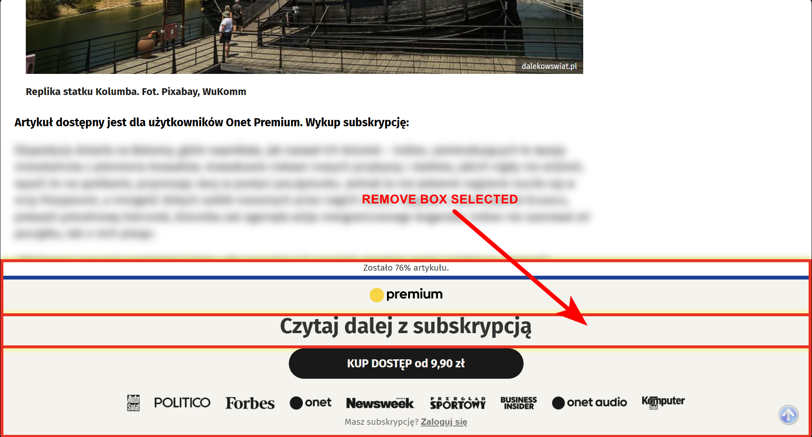

# Element remover (temporary) - Chrome extension.
Remove elements from page (work with iframe)

(not work on some pages ex. Google Maps, but if you use bokmarklet works OK) 

Exit - press "q" key

Search unclickable element - press "d" key and "del" key to delete. (only bokmarklet)

Undo - press "ctrl+z" keys




### bookmarklet code version:
```
javascript:(function(){var A=null,B=[],cs=el=>{el&&(el.style.outline="none",el.style.boxShadow="none")},as=el=>{el&&(el.style.outline="5px solid red",el.style.outlineOffset="-5px",el.style.boxShadow="0 0 10px yellow")},E=evt=>{evt.stopPropagation();evt.preventDefault();A&&A!==evt.target&&cs(A);A=evt.target;as(A)},F=evt=>{evt&&(evt.stopPropagation(),evt.preventDefault());A&&(B.push({element:A,parent:A.parentNode,nextSibling:A.nextSibling}),A.remove(),A=null)},G=()=>{if(B.length){var{element:el,parent:p,nextSibling:ns}=B.pop();p&&(ns&&ns.parentNode===p?p.insertBefore(el,ns):p.appendChild(el));cs(el);A=el}},H=()=>{try{A&&cs(A);var t=document.querySelector("#play > div > button.j7oslf.AnCkCf.waIsr.EPfCEf");t?(A=t,as(A)):A=null}catch(e){A=null}},J=()=>{document.removeEventListener("mouseover",E,!0);document.removeEventListener("click",F,!0);document.removeEventListener("keydown",I,!0);A&&(cs(A),A=null);B.forEach(({element:el})=>cs(el));B=[]},I=evt=>{var k=evt.key;"Delete"===k?F(evt):evt.ctrlKey&&"z"===k.toLowerCase()?(evt.preventDefault(),G()):"q"===k.toLowerCase()?J():"d"===k.toLowerCase()&&(evt.preventDefault(),H())};try{A&&cs(A);var S=document.querySelectorAll("button.j7oslf.AnCkCf.waIsr.EPfCEf");S.length>0?(A=S[0],as(A)):A=null}catch(e){A=null}document.addEventListener("mouseover",E,!0);document.addEventListener("click",F,!0);document.addEventListener("keydown",I,!0)})();
```
